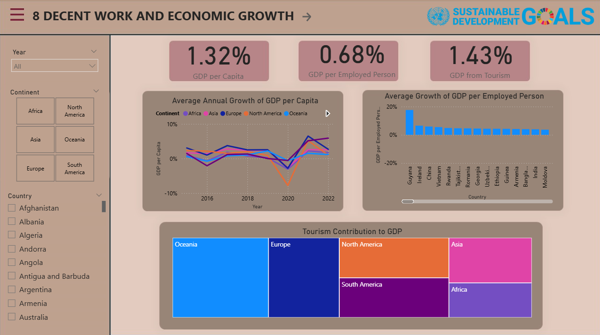
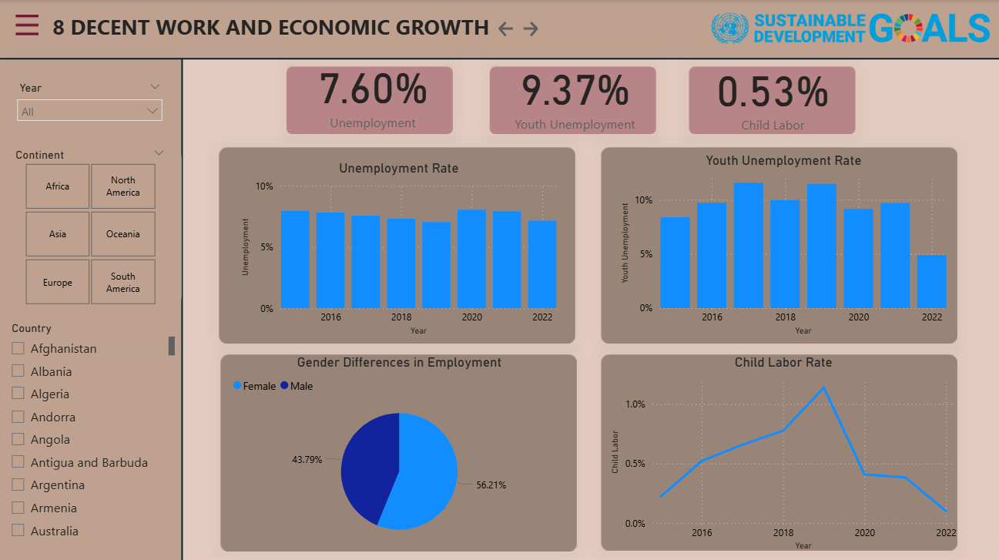
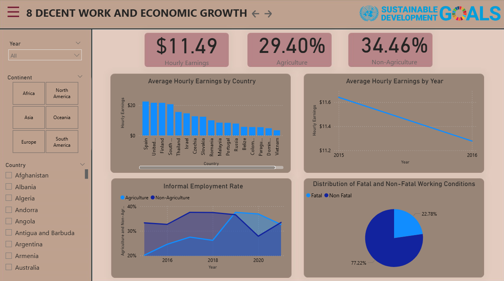
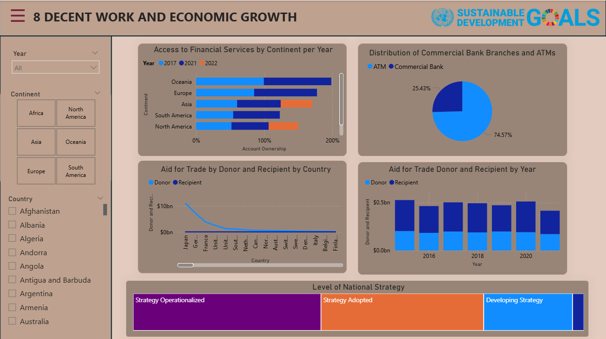

# SDG 8 Economic Growth & Labor Market Dashboard  
**Industry: Economic Development | Labor & Workforce Analytics**

---

## Executive Summary

This project presents an exploratory data analysis of **SDG 8: Decent Work and Economic Growth** using an interactive Power BI dashboard. The objective is to examine global economic growth patterns, labor market conditions, and productivity indicators across countries and regions.

The analysis addresses the following questions:
- How has economic growth evolved across regions over time?
- Are productivity gains reflected in labor market outcomes?
- Which regions are more dependent on tourism as a driver of growth?

### Key Findings
- GDP per capita growth declined sharply around 2020 across all regions, reflecting global economic disruption.
- Productivity growth (GDP per employed person) varies significantly by country, indicating uneven efficiency gains.
- Tourism contributes a larger share of GDP in specific regions, increasing exposure to external economic shocks.

---

## Methodology

- Integrated multiple publicly available SDG-related datasets covering economic growth, employment, wages, financial inclusion, and national strategies.
- Cleaned and modeled data using Power BI relationships and calculated measures.
- Built an interactive dashboard with KPI indicators, trend analysis, and regional comparisons.
- Implemented slicers for year, country, and continent to support exploratory analysis.

---

## Dashboard Overview

### Economic Growth

### Employment and Labor

### Wages, Informality, and Working Conditions

### Financial Inclusion and Policy

---

## Tools & Skills

- **Power BI** – data modeling, DAX measures, dashboard development  
- **Excel** – data cleaning and validation  
- **Data Analysis** – trend analysis, comparative analysis, KPI reporting  
- **Data Visualization** – translating data into clear insights  

---

## Results & Recommendations

- Economic growth does not consistently translate into improved employment quality.
- Productivity-focused and youth employment policies are critical for inclusive growth.
- Regions heavily dependent on tourism may benefit from economic diversification.

---

## Next Steps & Improvements

- Add benchmark comparisons (regional and global averages).
- Introduce drill-through pages for country-level analysis.
- Normalize indicators (per capita or % of GDP) for better comparability.
- Enhance storytelling with annotations and insight callouts.

---

*Note: This dashboard is intended for analytical and educational purposes using publicly available SDG-related data.*

# SDG 8 Economic Growth & Labor Market Dashboard
**Industry:** Economic Development | Labor & Workforce Analytics

---

## Executive Summary
This project presents an exploratory analysis of **SDG 8: Decent Work and Economic Growth**
using an interactive **Power BI dashboard** built on publicly available global datasets.

The objective is to examine **economic growth patterns, labor market conditions, productivity,
and financial inclusion** across countries and regions to support data-driven insights for
policy analysis, economic monitoring, and workforce planning.

---

## Business & Policy Questions
- How has economic growth evolved across regions over time?
- Do productivity gains translate into improved labor market outcomes?
- Which regions are more exposed to tourism-driven growth?
- How do employment quality, wages, and informality vary across countries?

---

## Key Insights
- GDP per capita growth declined sharply around 2020 across all regions, reflecting global economic disruption.
- Productivity growth (GDP per employed person) varies significantly by country, indicating uneven efficiency gains.
- Tourism contributes a larger share of GDP in specific regions, increasing exposure to external economic shocks.
- Economic growth does not consistently translate into improved employment quality indicators.

---

## Methodology
- Integrated multiple SDG-related datasets covering:
  economic growth, employment, wages, informality, financial inclusion, and national strategies.
- Cleaned and modeled data using **Power BI** with calculated measures and relationships.
- Built an interactive dashboard featuring:
  KPI indicators, trend analysis, and regional comparisons.
- Implemented slicers for **year, country, and continent** to support exploratory analysis.

---

## Dashboard Overview
The dashboard is organized into the following analytical sections:

### Economic Growth
- GDP per capita growth
- Productivity growth (GDP per employed person)
- Tourism contribution to GDP

### Employment & Labor
- Unemployment and youth unemployment rates
- Gender differences in employment
- Child labor trends

### Wages, Informality & Working Conditions
- Average hourly earnings
- Informal employment (agriculture vs non-agriculture)
- Fatal vs non-fatal occupational injuries

### Financial Inclusion & Policy
- Access to financial services by region
- Distribution of bank branches and ATMs
- Aid for trade (donor vs recipient)
- Level of national strategy adoption

---

## Tools & Skills Demonstrated
- **Power BI:** data modeling, DAX measures, dashboard development
- **Excel:** data cleaning and validation
- **Data Analysis:** trend analysis, comparative analysis, KPI reporting
- **Data Visualization:** translating complex data into clear insights

---

## Results & Recommendations
- Economic growth alone is not sufficient to ensure improvements in labor market quality.
- Productivity-focused and youth employment policies are critical for inclusive growth.
- Regions heavily dependent on tourism may benefit from economic diversification strategies.

---

## Next Steps & Enhancements
- Add benchmark comparisons (regional and global averages).
- Introduce drill-through pages for country-level analysis.
- Normalize indicators (per capita or % of GDP) for improved comparability.
- Enhance storytelling with annotations and insight callouts.

---

*Note: This dashboard is intended for analytical and educational purposes using publicly available SDG-related data.*

